# 复用与多址技术

## 复用技术（Multiplexing）

复用技术，就是实现在一个信道中传输多路信号的技术，有助于提高频谱利用率，常用的有频分复用、时分复用、码分复用三种技术

### 频分复用（FDM, Frequency Division Multiplexing）
频分复用就是将多路信号以不同频率调制传输的技术，本质上是将信号搬移到不同的频段内进行传输，各信号在时域上混叠，在频域上隔离。

特点是所有子信道传输的信号以并行的方式工作。

系统的组成原理图如下图所示。根据原理图可以看出，系统的总频带宽度大于各个子信道频带宽度之和。为了使各路信号互不干扰，在调制时还采用合适的带通滤波器（BPF）将不同频段隔离开。

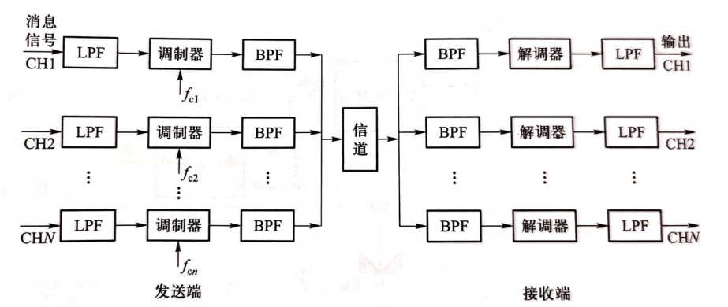

频谱结构如下图所示

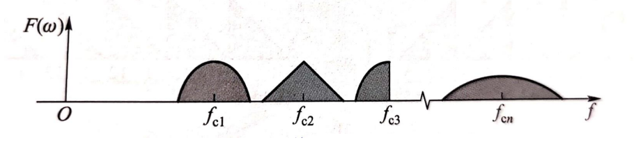

优点有：
1. 信道复用率高
2. 技术成熟等；

缺点有：
1. 对系统的非线性失真性能要求较高
2. 采用大量模拟滤波器，实现困难

### 时分复用（TDM, Time Division Multiplexing）

时分复用就是将传输信道的总时间划分为若干个子时隙传输多路信号的技术，本质是将信号在不同的时间段内进行传输，各信号在时域上隔离，在频域上混叠。

特点是将时间划分为一段段等长的时分复用帧（TDM Frame），每个时分用户在TDM帧中占用固定序号的时序

组成原理图如下

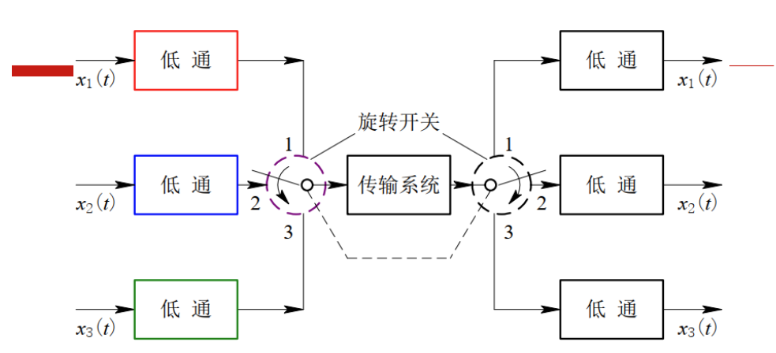

时域结构如下图所示

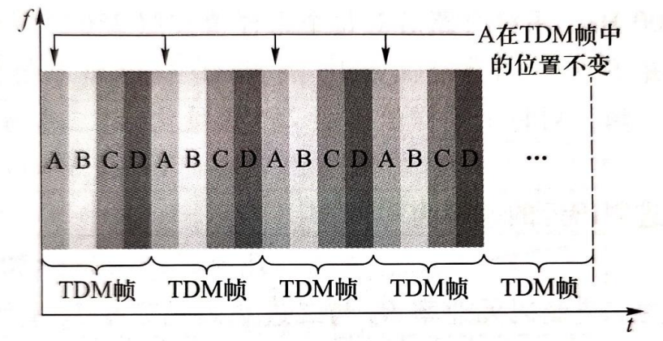

优点有：
1. 采用数字处理方式，便于实现
2. 对系统非线性失真要求较低

缺点有：
1. 对同步性能要求高

时分复用有对输入信号的交替采样，会涉及到采样时间的计算。
直接采样得到的是TDM-PAM波形，其脉冲宽度
$$T_a = \frac{T_s}{n}$$
其中$n$为信号路数，$T_s$为每路信号的采样间隔（应满足奈奎斯特间隔）。

对PAM进行量化编码，得到TDM-PCM波形，其脉冲宽度
$$T_b = \frac{T_a}{N} = \frac{1}{n\cdot N\cdot f_s}$$
其中$N$为量化编码的长度

可能会考察下面这样的题目：
> 课后题 8-7：有 32 路模拟话音信号采用时分复用 PCM 方式传输。每路话音信号带宽为 $4\mathrm{kHz}$，采用奈奎斯特速率采样，8 位编码，PCM 脉冲宽度为 $\tau$，占空比为 $100\%$ 。
> 
> (1) 试计算此 24 路 PCM 信号第一个零点带宽;
>
> $$f_s = 2\times 4 \mathrm{kHz} = 8 \mathrm{kHz}$$
> $$\tau = \frac{1}{n\cdot N\cdot f_s} \times 100\% = \frac{1}{32\times8\times8} \mathrm{kHz}$$
> 第一个零点带宽 
> $$B = \frac{1}{\tau} = 2048 \mathrm{kHz}$$
> 
> (2) 试计算此 24 路 PCM 系统最小带宽。
>
> $$B_{\min} = \frac{B}{2} = 1024 \mathrm{kHz}$$

### 码分复用（CDM, Code Division Multiplexing）
码分复用就是用不同的正交码将信道划分为多个子信道的技术。各信号在时间和频域上都混叠。

组成原理图如下，$m_1(𝑡)$、$m_2(𝑡)$、$m_3(𝑡)$、$m_4(𝑡)$是4路基带信号，$𝑐_1(𝑡)$、$c_2(𝑡)$、$c_3(𝑡)$、$c_4(𝑡)$是4组正交的码组

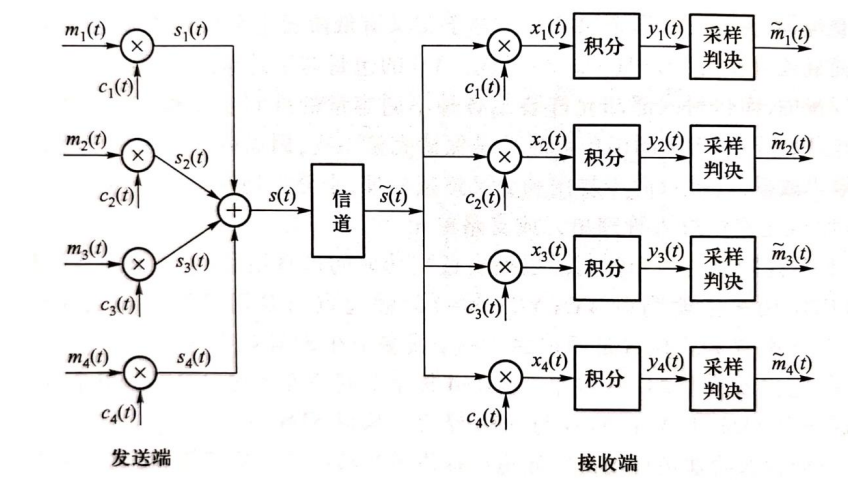

设 $c_1$ 、 $c_2$ 、 $c_3$ 和 $c_4$  4组正交码分别为
$$
\begin{array}{ll}
c_{1}=(-1-1-1+1+1-1+1+1) ， & c_{2}=(-1-1+1-1+1+1+1-1) \\
c_{3}=(-1+1-1+1+1+1-1-1), & c_{4}=(-1+1-1-1-1-1+1-1)
\end{array}
$$
则发送端和接收端的波形如下图所示

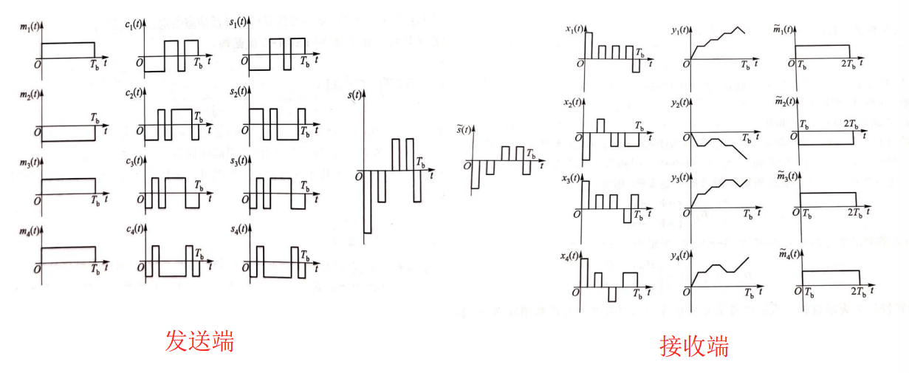

优点有：
1. 纯数字实现，实现简单
2. 同步性要求较低
3. 容量大，方便阔若
缺点有：
1. 单路信号的带宽要比FDM、TDM宽很多

## 多址技术 （Multiple Access）
多址技术，就是允许多个用户同时共享信道的技术。常用的有频分多址（FDMA）、时分多址（TDMA）、码分多址（CDMA）等技术

### 频分多址（FDMA, Frequency Division Multiple Access）
频分多址就是将频谱划分为若干个等间隔、不混叠的频道，每个子频道容纳一个用户。

典型的FDMA通信频道结构如下，它通常将工作频段划分为高频段和低频段，一个用于发射，一个用于接收，以频分双工（FDD）的形式实现双工通信。

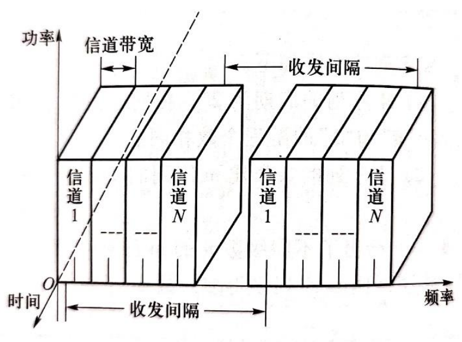

### 时分多址（TDMA, Time Division Multiple Access）
时分多址就是将时间分割成周期性的帧，每帧再分割成若干个的时隙，每个时隙容纳一个用户。

原理图如下，它通常将时域划分为上行帧和下行帧，一个用于发射，一个用于接收，以时分双工（TDD）的形式实现双工通信

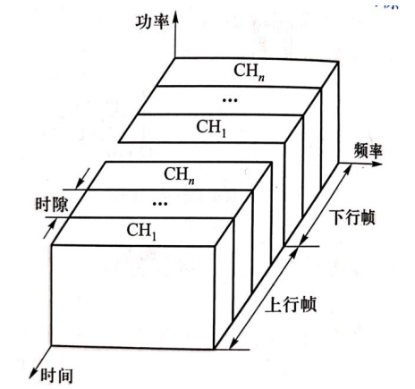

### 码分多址（CDMA, Code Division Multiple Access）

码分多址是为每个用户分配一个相互正交的伪随机序列地址码，利用码型和用户的一一对应关系来完成多用户通信。常用的有直扩码分多址和调频码分多址方式

#### 直扩码分多址（DS-CDMA）

原理图如下。发射端首先将用户数据序列与该用户的地址码序列相乘，然后经载波调制发射。接收端端使用该用户的地址码对接收信号进行解调，回复出用户数据序列。接收端要求系统严格同步。

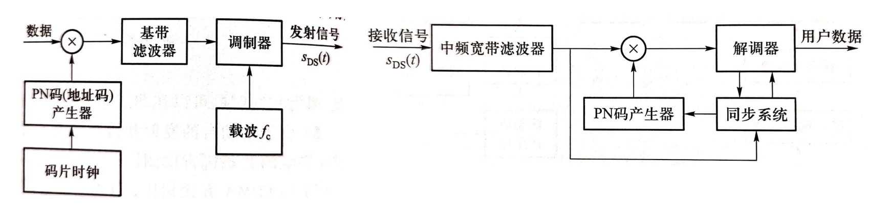

#### 跳频码分多址（FH-CDMA）
原理图如下。发射端首先为各个用户产生一个伪随机序列，用户地址码会根据伪随机序列动态占用窄带信道。接收时仍需要产生该伪随机序列实现跳频解调。接收端要求系统严格同步

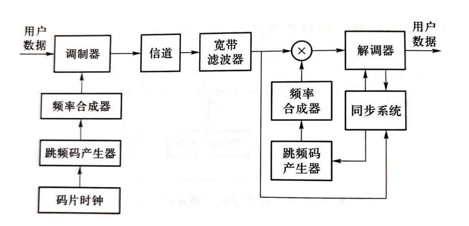

只有本地跳频码产生器产生的跳频图案与发送端的跳烦图案一致时，才能恢复出用户数据信息。

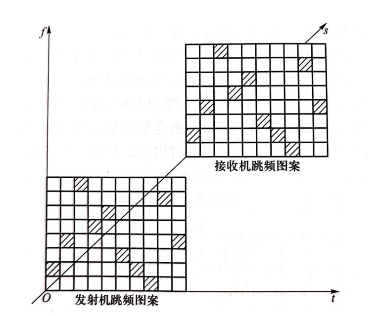

### 随机多址接入协议

实际通信网络中每个用户接入系统均是自由且随机的，因此需要随机的为用户分配地址，使全体用户共享信道资源。常用的随机接入协议有纯 ALOHA 协议、时隙 ALOHA 协议、载波监听多址接入协议（CSMA）等

感觉这里不会考（